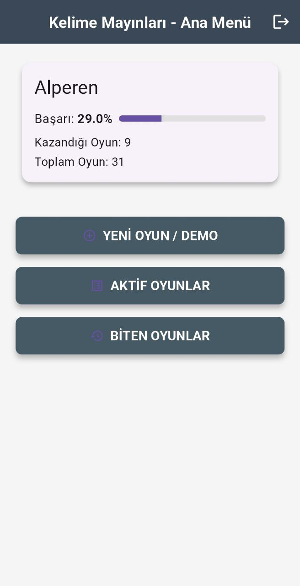
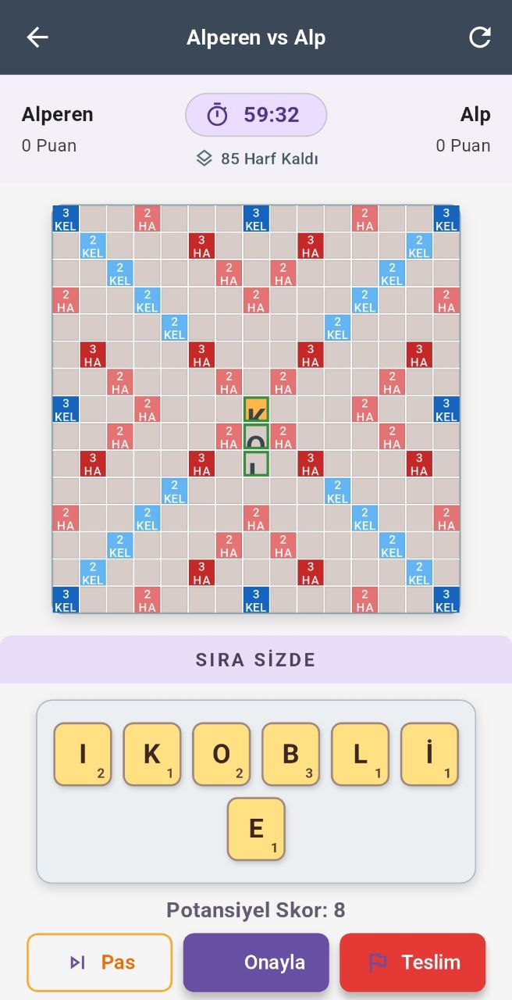
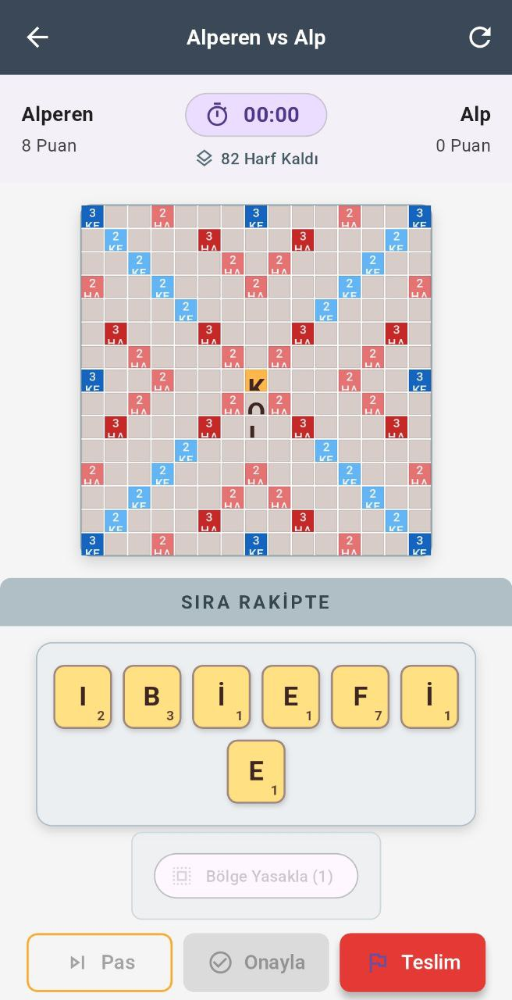
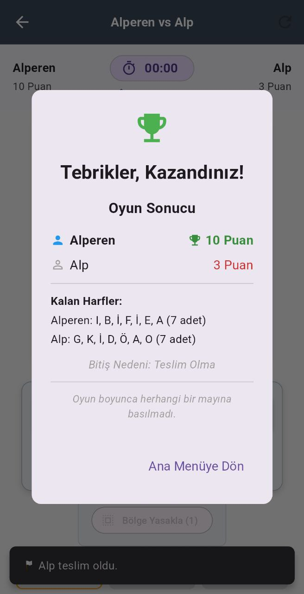
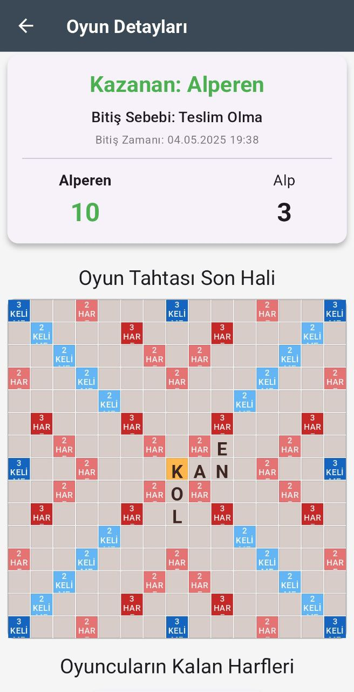

# Kelime Mayınları: Mobil Kelime Oyunu 

Flutter ve FastAPI ile geliştirilmiş mobil kelime oyunu.

---

## ✨ Öne Çıkan Özellikler

### <i class="bi bi-person-circle"></i> Kullanıcı Yönetimi ve Profil
* **Kayıt & Giriş:** Kullanıcı adı ve şifre ile güvenli kayıt ve giriş. Şifreler `bcrypt` ile hashlenerek korunur. Oturum yönetimi JWT (JSON Web Token) ile sağlanır.
* **Kullanıcı İstatistikleri:** Ana ekranda kazanma oranı, toplam oynanan oyun gibi kişisel istatistiklerin gösterimi.

### <i class="bi bi-grid-3x3-gap-fill"></i> Oyun Mekanikleri
* **Oyun Kurulumu ve Modları:**
    * **Rakip Bulma:** Gerçek zamanlı kuyruk sistemi ile diğer oyuncularla eşleşme.
    * **Bot'a Karşı Oyun:** Pratik yapmak için bot'a karşı "Demo Modu".
    * **Süre Seçenekleri:** Farklı oyun deneyimleri için çeşitli süre seçenekleri (2dk, 5dk, 12sa, 24sa).
* **Dinamik Oyun Tahtası:**
    * Standart 15x15 boyutunda oyun alanı.
    * **Özel Kareler:** Harf Çarpanı (2x, 3x Harf), Kelime Çarpanı (2x, 3x Kelime) ve başlangıç noktası gibi kareler.
    * **Mayınlar ve Ödüller:** Oyun başında backend tarafından tahtaya rastgele yerleştirilen, oyuna heyecan katan mayınlar ve ödüller.
* **Harf Yönetimi:**
    * Her oyuncuya özel harf istakası (rack).
    * Havuzda kalan harf sayısının takibi.
* **Hamle Yapma ve Kelime Oluşturma:**
    * Istakadaki harfleri tahtada seçip yerleştirerek anlamlı kelimeler oluşturma.
    * **Joker Kullanımı:** Joker harfini istenilen bir harf yerine kullanabilme.
    * **Hamle Doğrulama:** Oluşturulan kelimelerin Türkçe sözlükte (`kelime_listesi.txt`) olup olmadığı ve tahtaya doğru yerleştirilip yerleştirilmediği backend tarafından kontrol edilir.
* **Detaylı Skorlama:**
    * Kelimelerin puanı, harflerin kendi değerleri (`letter_points.dart`) ve üzerinde durdukları özel karelerin çarpan etkileriyle hesaplanır.
* **Mayın ve Ödül Etkileşimleri:**
    * **Mayınlar:** Kelime yerleştirirken mayınlı bir kareye denk gelinmesi durumunda çeşitli olumsuz etkiler.
    * **Ödüller:** Oyun içinde kazanılan ve stratejik avantaj sağlayan ödüller:
        * <i class="bi bi-shield-slash"></i> **Bölge Yasakla:** Rakibin belirli bir alana harf koymasını engelleme.
        * <i class="bi bi-type"></i> **Harf Yasakla:** Rakibin belirli bir harfi kullanmasını engelleme.
        * <i class="bi bi-arrow-clockwise"></i> **Ekstra Hamle:** Ekstra bir hamle hakkı kazanma.

### <i class="bi bi-broadcast"></i> Gerçek Zamanlı Etkileşim (WebSocket)
* **Anlık Oyun Güncellemeleri:** Oyun tahtası, skorlar, oyuncu sırası gibi tüm değişiklikler WebSocket aracılığıyla tüm oyunculara anında iletilir.
* **Sıra Takibi:** Kimin hamle yapacağının net bir şekilde gösterilmesi ve yönetilmesi.
* **Bildirimler:** Rakip hamlesi, oyun sonu gibi önemli olaylarda anlık bildirimler.

### <i class="bi bi-controller"></i> Oyun Akışı ve Arayüz
* **Sıra Yönetimi:** Aktif oyuncuyu belirten net bir gösterge (`turn_indicator.dart`).
* **Oyun Bilgi Paneli:** Oyuncuların güncel skorları, kalan süre, torbada kalan harf sayısı gibi önemli bilgilerin gösterildiği arayüz (`game_info_bar.dart`).
* **Oyun Sonu Koşulları:** Oyun; oyunculardan birinin teslim olması, bir oyuncunun tüm harflerini bitirmesi, belirlenen sürenin dolması veya art arda pas geçilmesi gibi durumlarda sona erer.
* **Detaylı Sonuç Ekranı:** Oyun bittiğinde kazanan/kaybeden bilgisi, final skorları ve diğer istatistiklerin gösterildiği bir özet ekranı (`game_end_dialog_content.dart`).

### <i class="bi bi-list-task"></i> Oyun Listeleri ve Takip
* **Aktif Oyunlar:** Devam etmekte olan oyunlarınızı kolayca listeleyin ve erişin (`active_games_screen.dart`).
* **Biten Oyunlar:** Tamamlanmış oyunlarınızı ve sonuçlarını gözden geçirin (`finished_games_screen.dart`).

### <i class="bi bi-gear-fill"></i> Ayarlar
* **Sunucu Adresi Yapılandırması:** Geliştirme veya farklı backend ortamları için sunucu (API) adresini değiştirebilme imkanı.

---

## 🛠️ Kullanılan Teknolojiler

* **Backend:**
    * Python
    * FastAPI
* **Frontend (Mobil Uygulama):**
    * Dart
    * Flutter
* **Veritabanı:**
    * MongoDB

---

## 🚀 Kullanım Kılavuzu

1.  **Hesap Oluşturun / Giriş Yapın:** Uygulamayı açın, "Kayıt Ol" ekranından yeni bir hesap oluşturun veya mevcut hesabınızla "Giriş Yap"ın.
2.  **Ana Menüyü Keşfedin:** Giriş yaptıktan sonra ana menüde istatistiklerinizi görebilir, yeni bir oyun başlatabilir veya mevcut oyunlarınıza göz atabilirsiniz.
3.  **Oyun Başlatın:**
    * "Yeni Oyun" seçeneği ile istediğiniz süre ayarını seçin.
    * Rakip bulunmasını bekleyin veya "Bot'a Karşı Oyna" seçeneği ile demo modunda başlayın.
4.  **Oyun Oynayın:**
    * Sıra size geldiğinde ıstakanızdaki harfleri kullanarak tahtada kelimeler oluşturun.
    * Jokerleri ve özel kareleri stratejik olarak kullanın.
    * Kazandığınız ödülleri doğru zamanda kullanarak avantaj elde edin.
5.  **Oyunlarınızı Takip Edin:** "Aktif Oyunlar" ve "Biten Oyunlar" listelerinden oyunlarınızın durumunu kontrol edin.
6.  **(Opsiyonel) Ayarlar:** "Ayarlar" bölümünden sunucu adresini yapılandırabilirsiniz.

---

## 📸 Uygulama Görselleri

*(Uygulamanın temel ekranlarından bazıları aşağıdadır.)*

**Ana Ekran ve Oyun İçi Görünümler:**

|                    Ana Sayfa                    |             Potansiyel Skor Gösterimi              |            Rakip Sırası & Ödül Kullanımı            |
|:-----------------------------------------------:|:--------------------------------------------------:|:---------------------------------------------------:|
|                |       |               |
| _Kullanıcı istatistikleri ve oyun seçenekleri._ | _Hamle yapılırken potansiyel skorun gösterilmesi._ | _Rakip sırası ve oyuncunun ödül kullanma seçeneği._ |

**Oyun Sonu ve Detaylar:**

|               Teslim Olma Sonucu                |        Oyun Detayları (Son Durum)         |
|:-----------------------------------------------:|:-----------------------------------------:|
|              |    |
| _Bir oyuncu teslim olduğunda oyun sonu ekranı._ |  _Tamamlanmış bir oyunun detaylı özeti._  |

---
